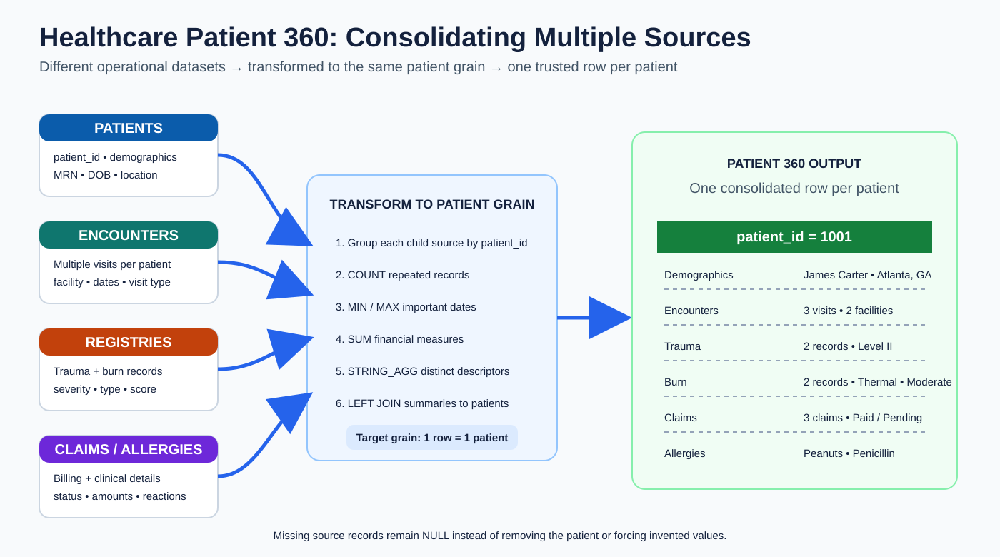
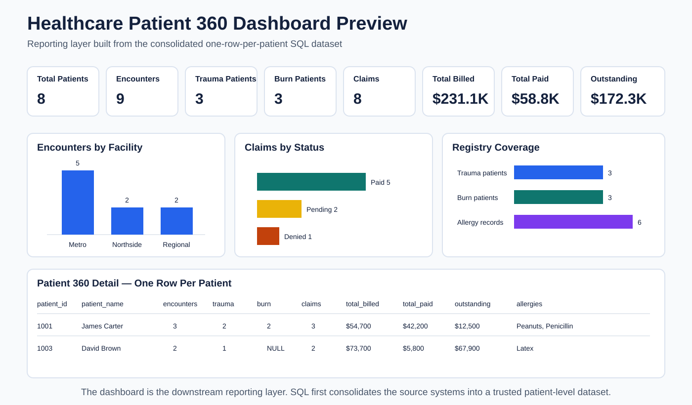

# Healthcare Patient 360 SQL Demo

A PostgreSQL portfolio project showing how to combine information from multiple healthcare source systems into **one consolidated row per patient**.



## The problem

Healthcare information is often split across separate systems and tables:

- patient demographics
- encounters
- trauma registry
- burn registry
- claims
- allergies

The same patient ID can appear multiple times in several source tables because one patient can have many encounters, claims, registry records, or allergies.

The goal is not simply to join the tables. The goal is to bring all relevant information together while preserving the intended output grain:

> **1 row = 1 patient**

If a patient has data in a source, that information is carried into the row. If a patient has no matching record in a source, the related output columns remain `NULL`.

## Solution approach

Each one-to-many source table is first summarized to the patient level, then the summaries are joined back to the patient table.

Examples:

- encounters → count, first date, latest date, facilities, encounter types
- trauma registry → record count, injury types, severity score, trauma level
- burn registry → record count, burn types, burn percentage, severity
- claims → claim count, billed total, paid total, outstanding amount, statuses
- allergies → allergy count and allergy list

Then PostgreSQL `LEFT JOIN`s each patient-level summary back to `patients`.

This produces a wide Patient 360 dataset where all available information is visible on one row.

## Why aggregation happens before the final join

Raw child tables can each contain multiple rows for the same patient. Joining every raw table together first can create many row combinations.

Instead, this project controls the grain before the final join:

```text
encounters       many rows -> 1 patient summary
trauma_registry  many rows -> 1 patient summary
burn_registry    many rows -> 1 patient summary
claims           many rows -> 1 patient summary
allergies        many rows -> 1 patient summary
                           |
                           v
                      LEFT JOIN
                           |
                           v
                    1 row per patient
```

## Dashboard / reporting layer



The SQL output can feed analytics and reporting without rebuilding the source logic in the visualization layer.

The included dashboard-ready CSV supports:

- Total Patients
- Total Encounters
- Trauma Patients
- Burn Patients
- Total Claims
- Total Billed
- Total Paid
- Outstanding Amount
- Encounters by Facility
- Claims by Status
- registry coverage
- patient-level detail

See [`dashboard/patient_360_dashboard.csv`](dashboard/patient_360_dashboard.csv).

## SQL techniques demonstrated

- PostgreSQL
- Common Table Expressions (`WITH`)
- `LEFT JOIN`
- `GROUP BY`
- `COUNT`
- `MIN` / `MAX`
- `SUM`
- `STRING_AGG`
- `DISTINCT`
- primary and foreign keys
- indexes
- reusable database views
- validation queries

## Project structure

```text
healthcare-patient-360-sql-dem/
├── README.md
├── sql/
│   ├── 01_schema.sql
│   ├── 02_seed_data.sql
│   ├── 03_problem_query.sql
│   ├── 04_solution_query.sql
│   ├── 05_validation_queries.sql
│   └── 06_patient_360_view.sql
├── docs/
│   ├── architecture.md
│   ├── before-after.md
│   ├── data-model.md
│   └── patient-360-consolidation.svg
├── dashboard/
│   ├── README.md
│   ├── patient_360_dashboard.csv
│   └── patient-360-dashboard-preview.svg
└── sample_output/
    └── expected_patient_360.csv
```

## How to test

Use PostgreSQL or an online PostgreSQL environment such as DB Fiddle.

1. Run `sql/01_schema.sql`.
2. Run `sql/02_seed_data.sql`.
3. Run `sql/03_problem_query.sql` to inspect the raw multi-table join behavior.
4. Run `sql/04_solution_query.sql` to produce the consolidated patient-level output.
5. Run `sql/05_validation_queries.sql` to verify repeated patient IDs exist in the source tables.
6. Run `sql/06_patient_360_view.sql` to create the reusable `patient_360` view.

Then:

```sql
SELECT *
FROM patient_360
ORDER BY patient_id;
```

## Key design takeaway

The main lesson is **grain control across multiple source systems**.

Before combining datasets, define the row you want in the final output. In this project, every child source is transformed to the same patient grain first. That allows information from several databases/tables to be represented in one complete row without losing patients who have missing source data.

## Portfolio explanation

> I modeled several healthcare source datasets that each contained different information about the same patients. Because some of those sources had multiple records per patient, I first summarized each source to the patient level. I then used LEFT JOINs to combine the summaries into a single Patient 360 row, preserving NULLs where a source had no record. The result is a reusable dataset that can support reporting and dashboards.

## Disclaimer

All names and healthcare records in this repository are fictional and were created solely for portfolio and learning purposes. No real patient data or proprietary company information is included.
