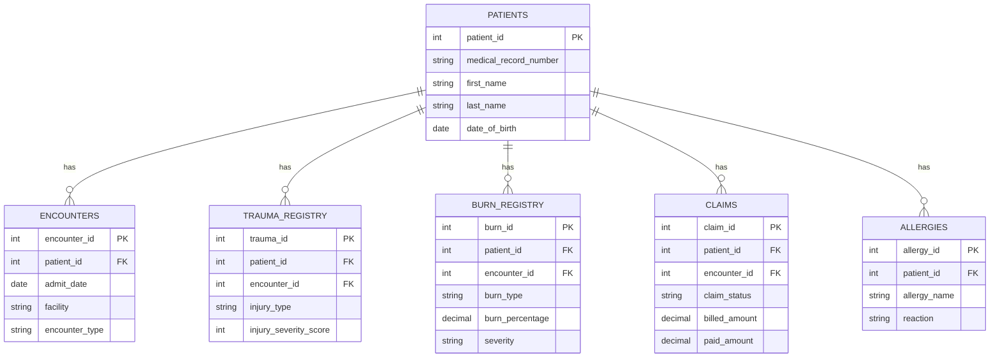

# Data Model

```mermaid
erDiagram
    PATIENTS ||--o{ ENCOUNTERS : has
    PATIENTS ||--o{ TRAUMA_REGISTRY : has
    PATIENTS ||--o{ BURN_REGISTRY : has
    PATIENTS ||--o{ CLAIMS : has
    PATIENTS ||--o{ ALLERGIES : has

    PATIENTS {
        int patient_id PK
        string medical_record_number
        string first_name
        string last_name
        date date_of_birth
    }

    ENCOUNTERS {
        int encounter_id PK
        int patient_id FK
        date admit_date
        string facility
        string encounter_type
    }

    TRAUMA_REGISTRY {
        int trauma_id PK
        int patient_id FK
        int encounter_id FK
        string injury_type
        int injury_severity_score
    }

    BURN_REGISTRY {
        int burn_id PK
        int patient_id FK
        int encounter_id FK
        string burn_type
        decimal burn_percentage
        string severity
    }

    CLAIMS {
        int claim_id PK
        int patient_id FK
        int encounter_id FK
        string claim_status
        decimal billed_amount
        decimal paid_amount
    }

    ALLERGIES {
        int allergy_id PK
        int patient_id FK
        string allergy_name
        string reaction
    }
```

## Target grain
The final Patient 360 dataset is intentionally designed as:

**1 row = 1 patient**

Each one-to-many child source is aggregated to that grain before the final joins.
